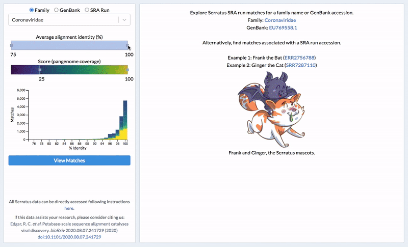

# serratus.io

Serratus is an Open Science project with a goal of uncovering coronaviruses hidden in the NCBI SRA database.
This repository is home to the front-facing website of the project, and contains tools for anyone to observe Serratus analyses.

The website was bootstrapped with `create-react-app` and leverages D3.js for visualizations. If you are interested in contributing, see [CONTRIBUTING.md](CONTRIBUTING.md).

This repository is just one of the main repositories involving Serratus:

1. Repository for Serratus database curation: [serratus-bio/serratus-summary-uploader](https://github.com/serratus-bio/serratus-summary-uploader)
2. Repository for Serratus REST API: [serratus-bio/serratus-summary-api](https://github.com/serratus-bio/serratus-summary-api)
2. Repository for Serratus website: [serratus-bio/serratus.io](https://github.com/serratus-bio/serratus.io)
3. Repository for Serratus data exploration R package: [serratus-bio/tantalus](https://github.com/serratus-bio/tantalus)
4. Repository for Serratus bioinformatics work: [ababaian/serratus](https://github.com/ababaian/serratus)

## Serratus Explorer

This page allows users to explore Serratus data on 3 different levels:

1. Taxonomy family
2. GenBank accession
3. SRA Run accession

