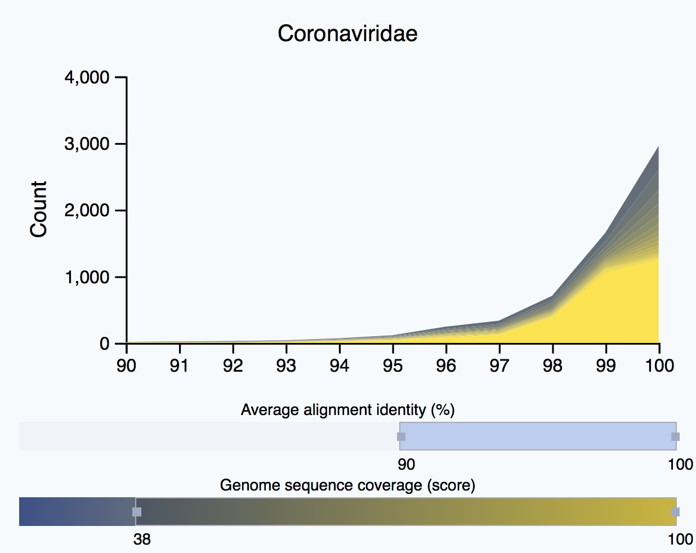
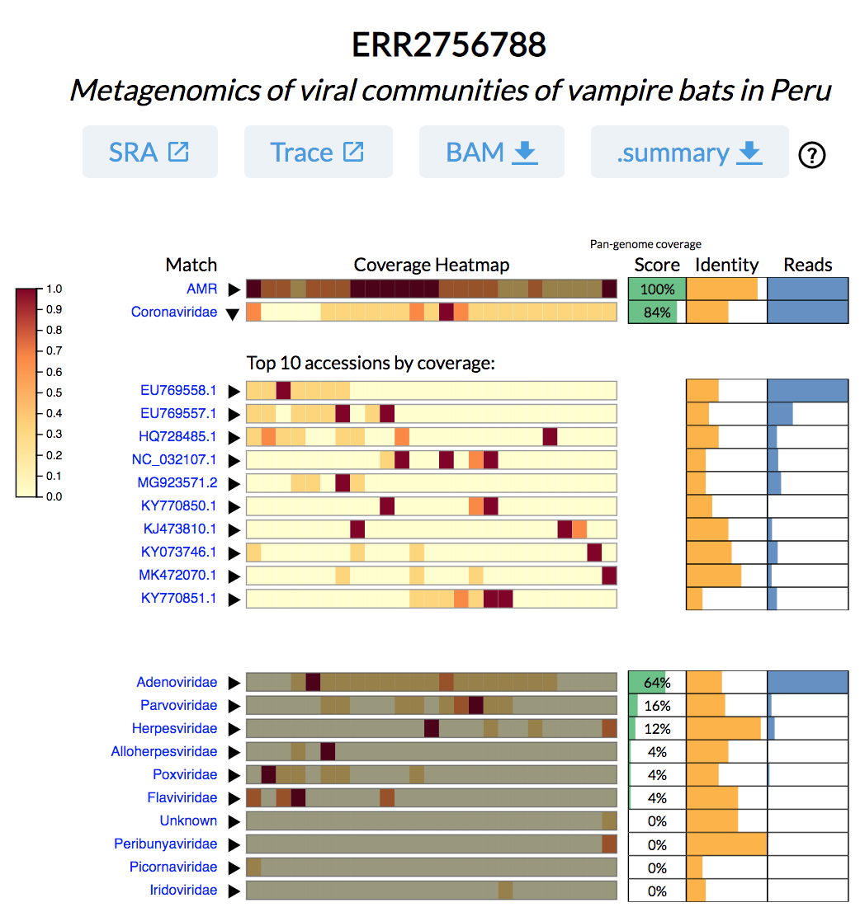

# serratus.io

Serratus is an Open Science project with a goal of uncovering coronaviruses hidden in the NCBI SRA database.
This repository is home to the front-facing website of the project, and contains tools for anyone to observe Serratus analyses.

The website was bootstrapped with `create-react-app` and leverages D3.js for visualizations. If you are interested in contributing, see [CONTRIBUTING.md](CONTRIBUTING.md).

The Database API is managed in a separate repository: [serratus-db](https://github.com/serratus-bio/serratus-db)

## Visualization Pages

### Explore

This page allows users to explore a family-level overview of the data processed by Serratus.

In the near future, users will be able to click a button to view the respective Query page for applied filters.

### Query

The Query page allows users to view a visual summary report of any SRA run analyzed by Serratus.

Example: [Frank (ERR2756788)](https://serratus.io/query?run=ERR2756788)

Users can also query for all SRA runs matching a given viral family or GenBank accession (pagination coming soon).
